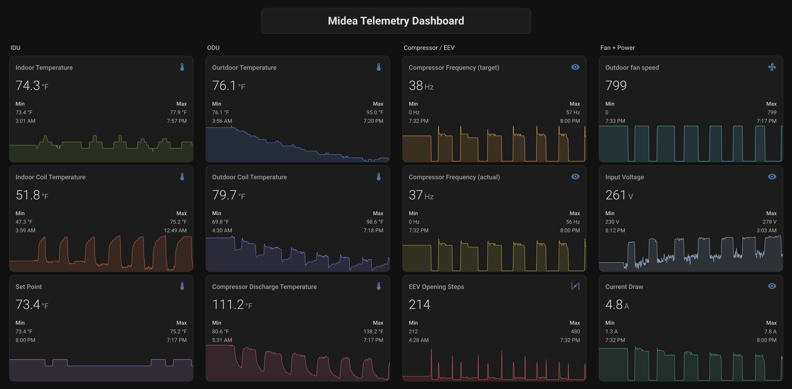
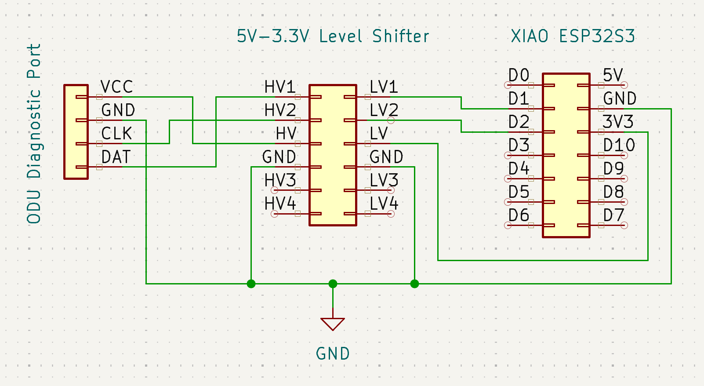
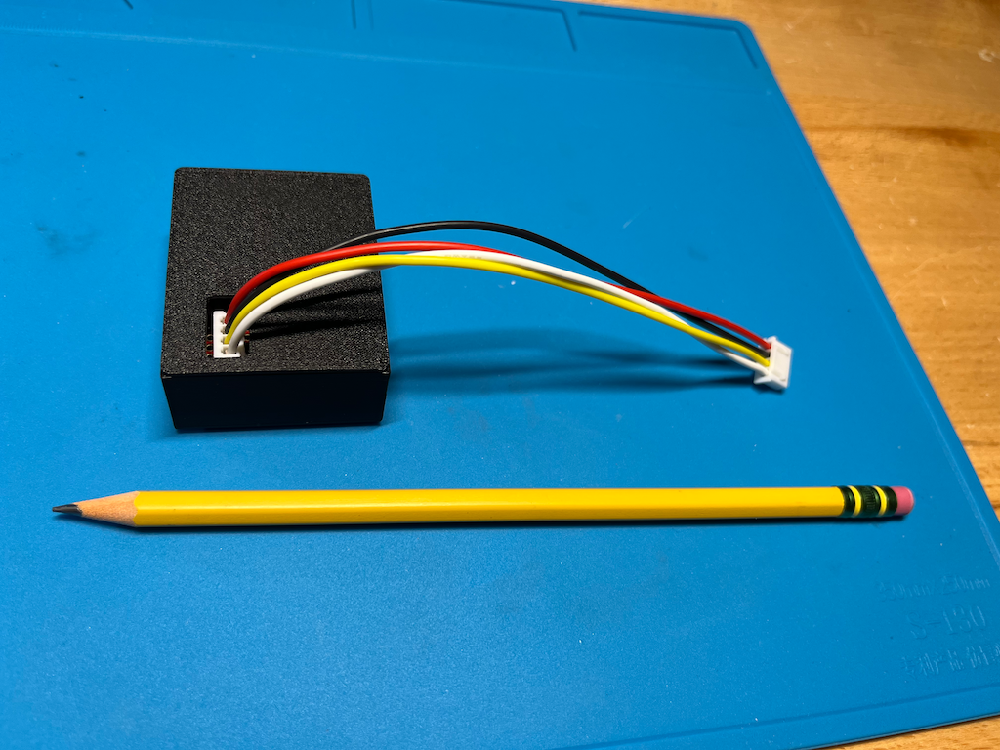

# midea-telemetry-esphome

An [ESPHome](https://esphome.io/) component to feed telemetry from Midea's diagnostic port into Home Assistant. It drives the diagnostic port the same way Midea's handheld inverter tester does.



13 sensors are currently supported. See [Fields](#fields) for the full list.

> ⚠️ **Safety.** The outdoor unit runs on mains voltage and can retain a dangerous charge after being unplugged. Only plug a connector into the diagnostic port if you know what you are doing. You are responsible for your own hardware and safety.

## Prior Art

I've documented the diagnostic bus protocol in great detail on Medium: [Reverse Engineering Midea's ODU Diagnostic Port](https://medium.com/@florian.mckee/reverse-engineering-mideas-odu-diagnostic-port-af603e159053). The firmware in this repository is based on those findings. Start there if you want to understand the protocol; the byte mappings and conversion formulas in the [Fields](#fields) table come straight from it.

## Hardware

All you need is a **dual-core ESP32** and a level shifter. A dual core is required because the bus bit-banging runs in a dedicated FreeRTOS task — a full request/response cycle keeps the bus busy for ~380 ms, far too long to run on the main loop.



Recommended hardware:
- [XIAO ESP32S3](https://www.amazon.com/dp/B0BYSB66S5)
- [3.3V–5V Level Shifter](https://www.amazon.com/dp/B07F7W91LC)
- [Mini PCB Prototype boards](https://www.amazon.com/dp/B081MSKJJX)

I used the following connector kits, but you can get away with a single 4-pin male JST-XH connector:
- [XH 2.54mm Connector Kit](https://www.amazon.com/dp/B08G18PWQ6)
- [JST-XHP Connector Kit](https://www.amazon.com/dp/B07CTH46S7)

The assembled prototype:


3D printed enclosure:




## Configuration

See [example-config/device.yaml](example-config/device.yaml) for a complete, flashable configuration with all 13 sensors. The short version:

```yaml
external_components:
  - source: github://fmck3516/midea-telemetry-esphome   # or, for a local checkout:
    components: [midea_telemetry]                        # - source: components

midea_telemetry:
  clk_pin: GPIO3   # D2 on the XIAO ESP32S3
  dat_pin: GPIO2   # D1
  update_interval: 10s

sensor:
  - platform: midea_telemetry
    outdoor_coil_temperature:
      name: Outdoor coil temperature
    compressor_frequency_actual:
      name: Compressor frequency (actual)
    # ... every field from the Fields table below is available
```

## Flashing

Flash your ESP32 with `esphome`. On macOS:

```sh
brew install esphome
cd example-config
# create secrets.yaml with wifi_ssid / wifi_password, then:
esphome run device.yaml
```

## Fields

Byte mapping and conversion formulas as documented in [Reverse Engineering Midea's ODU Diagnostic Port](https://medium.com/@florian.mckee/reverse-engineering-mideas-odu-diagnostic-port-af603e159053):

| Sensor | Unit | Response type | Bytes |
|---|---|---|---|
| `indoor_ambient_temperature` | °C | `0x00` | 2 (NTC, Beta model) |
| `indoor_coil_temperature` | °C | `0x00` | 3 (NTC, Beta model) |
| `outdoor_ambient_temperature` | °C | `0x00` | 5 (NTC, Beta model) |
| `outdoor_coil_temperature` | °C | `0x00` | 4 (NTC, Beta model) |
| `discharge_temperature` | °C | `0x00` | 6 (NTC, Steinhart-Hart) |
| `operating_mode` | raw code | `0x02` | 8 |
| `compressor_frequency_target` | Hz | `0x02` | 2 |
| `compressor_frequency_actual` | Hz | `0x02` | 3 |
| `outdoor_fan_speed` | raw | `0x00` | 7+8 (uint16) |
| `eev_steps` | raw | `0x01` | 5+6 (uint16) |
| `indoor_setpoint` | °C | `0x01` | 7 (tentative mapping) |
| `input_voltage` | V | `0x01` | 3 |
| `current_draw` | A | `0x01` | 2 |

`operating_mode` is a raw integer code (e.g. `0` = cooling, `3` = fan). Map it to text in Home Assistant with a template sensor.