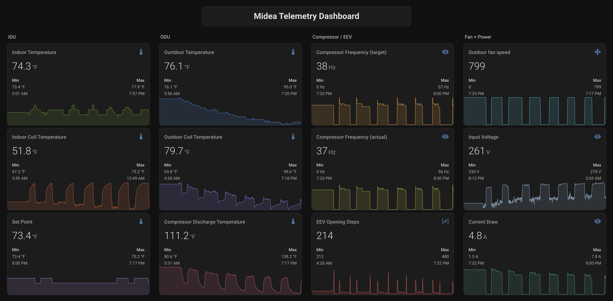
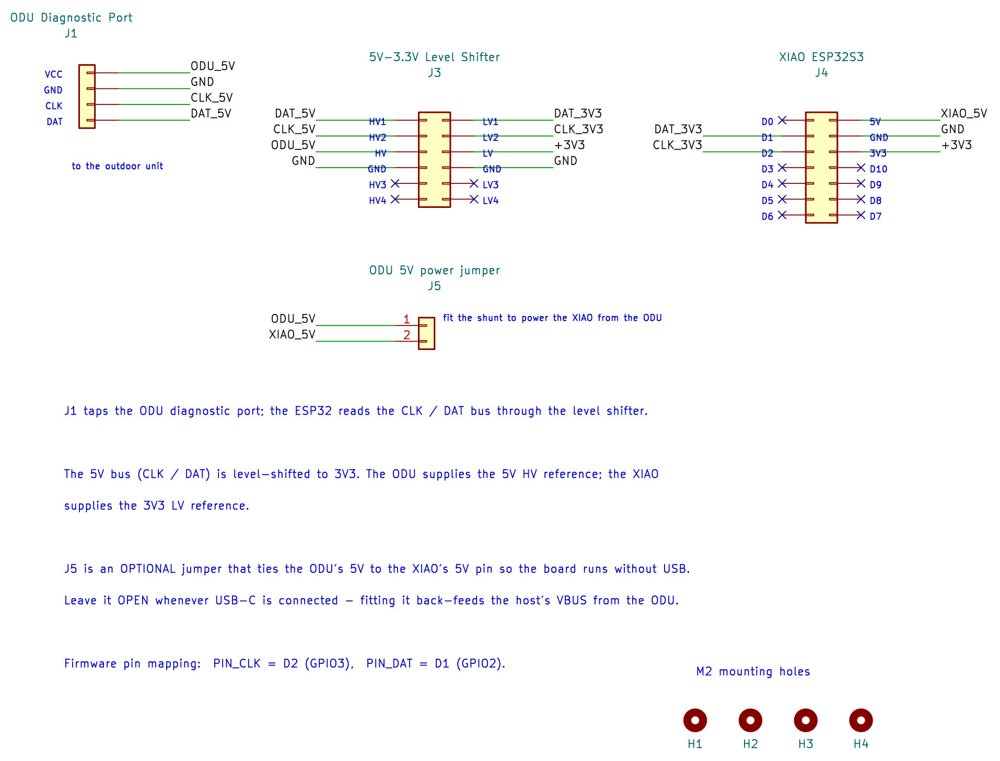
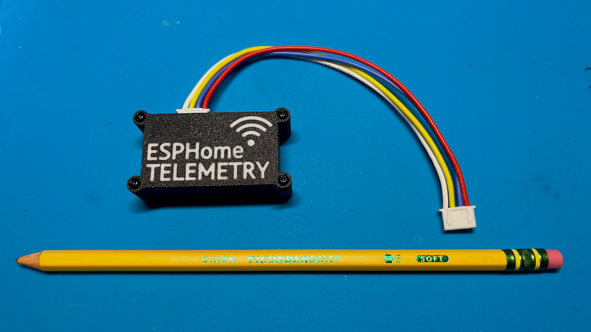
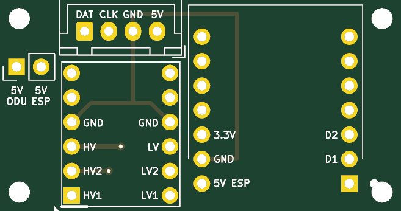
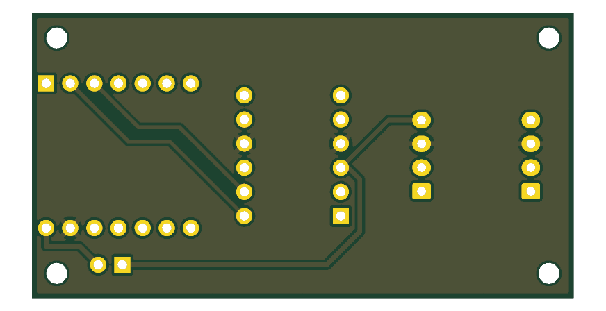
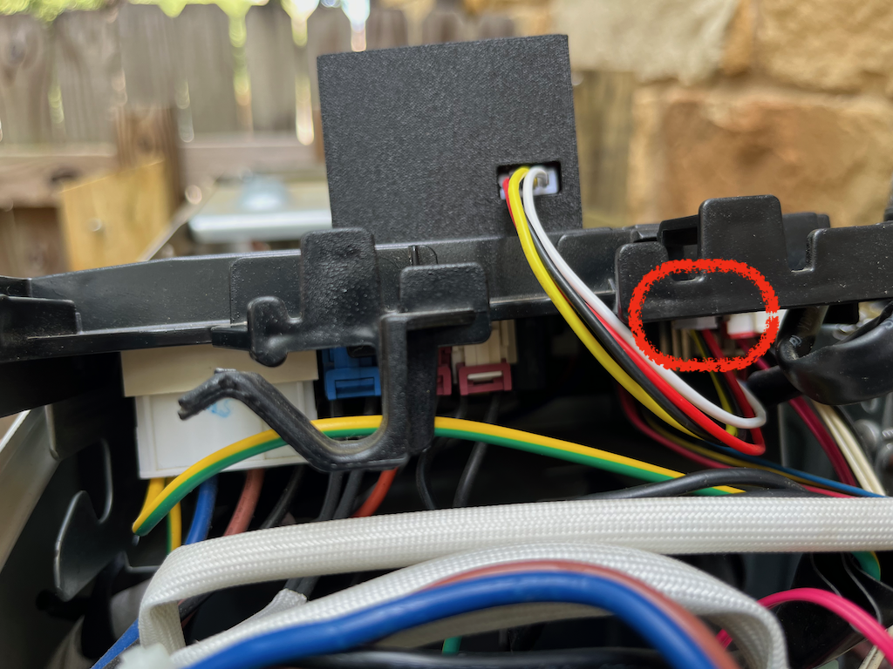
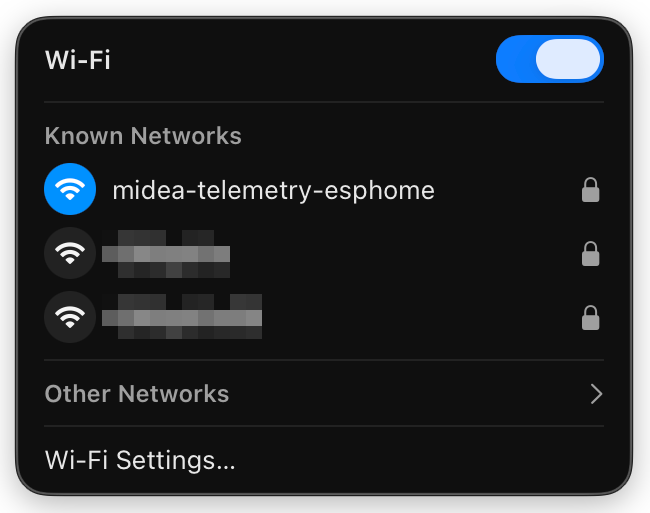
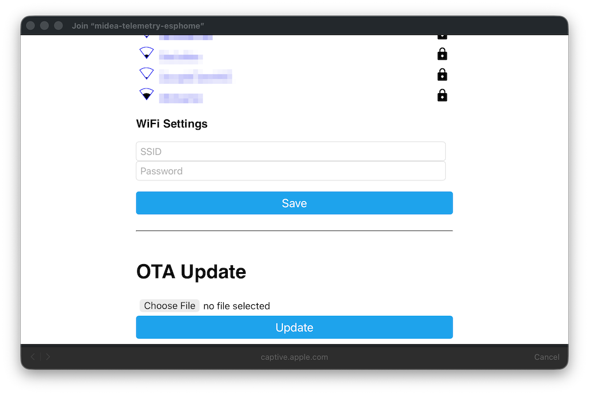
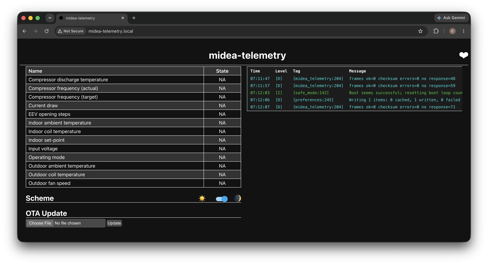
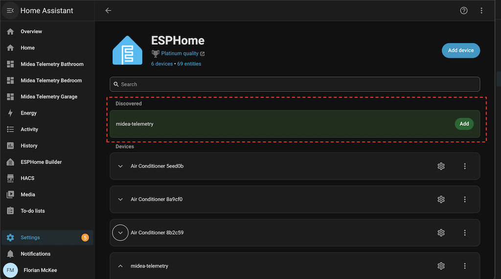

# midea-telemetry-esphome

An [ESPHome](https://esphome.io/) component to feed telemetry from Midea's diagnostic port into Home Assistant. It drives the diagnostic port the same way Midea's handheld inverter tester does.



15 sensors are currently supported. See [Fields](#fields) for the full list.

> ⚠️ **Safety.** The outdoor unit runs on mains voltage and can retain a dangerous charge after being unplugged. Only plug a connector into the diagnostic port if you know what you are doing. You are responsible for your own hardware and safety.

## Disclaimer

Midea is a trademark of Midea Group. This is an independent, unofficial hobby project and is not affiliated with, authorized, endorsed by, or sponsored by Midea. The name is used only to describe which hardware the project interoperates with. All product names and trademarks are the property of their respective owners.


## Prior Art

I've documented the diagnostic bus protocol in great detail on Medium: [Reverse Engineering Midea's ODU Diagnostic Port](https://medium.com/@florian.mckee/reverse-engineering-mideas-odu-diagnostic-port-af603e159053). The firmware in this repository is based on those findings. Start there if you want to understand the protocol; the byte mappings and conversion formulas in the [Fields](#fields) table come straight from it.

## Hardware

All you need is a **dual-core ESP32** and a level shifter. A dual core is required because the bus bit-banging runs in a dedicated FreeRTOS task. A full request/response cycle keeps the bus busy for ~380 ms, far too long to run on the main loop.



Recommended hardware:
- [XIAO ESP32S3](https://www.amazon.com/dp/B0BYSB66S5)
- [3.3V–5V Level Shifter](https://www.amazon.com/dp/B07F7W91LC)
- [Mini PCB Prototype boards](https://www.amazon.com/dp/B081MSKJJX)

I used the following connector kits, but you can get away with a single 4-pin male JST-XH connector:
- [XH 2.54mm Connector Kit](https://www.amazon.com/dp/B08G18PWQ6)
- [JST-XHP Connector Kit](https://www.amazon.com/dp/B07CTH46S7)

The assembled prototype:


I've added a jumper that ties the diagnostic port's +5V to the XIAO's 5V pin. Use the jumper to run the board straight off the ODU with no USB cable. Leave it off if the board is connected to USB. I also recommend the use of a USB isolator since ground on the diagnostic port is not referenced to earth.

3D printed enclosure:



### PCB

I've created a PCB to replace the perfboard. You solder in two connectors, the level shifter module and the XIAO, and that's the whole build. The KiCad project, schematic and orderable gerbers live in [pcb/](pcb/).

| Top | Bottom |
|---|---|
|  |  |

2-layer, 57 × 30 mm, 1.6 mm, ground plane on both sides, four M2 mounting holes.

Note: This board has not been fabricated or verified yet.

## Configuration

See [example-config/device.yaml](example-config/device.yaml) for a complete, flashable configuration with all 15 sensors. The short version:

```yaml
external_components:
  - source: github://fmck3516/midea-telemetry-esphome
    components: [midea_telemetry]

midea_telemetry:
  clk_pin: GPIO3   # D2 on the XIAO ESP32S3
  dat_pin: GPIO2   # D1
  update_interval: 10s

sensor:
  - platform: midea_telemetry
    outdoor_coil_temperature:
      name: Outdoor coil temperature
    compressor_frequency_actual:
      name: Compressor frequency (actual)
    # ... every field from the Fields table below is available
```

### Raw frames

The component can also expose the raw diagnostic frames as hex text (e.g. `0x55006D457671401F03B0`) via a `text_sensor` platform. These show up in the web server and Home Assistant next to the decoded sensors — handy for debugging or further reverse engineering. There is one entry per response type (`response_0`–`response_6`, each tracking the latest frame of that type) and one per fixed tester request (`request_0`–`request_3`):

```yaml
text_sensor:
  - platform: midea_telemetry
    response_0:
      name: Response 0x00
    response_2:
      name: Response 0x02
    # ... response_0–response_6 and request_0–request_3 are all available
```

## Flashing

Flash your ESP32 with `esphome`. On macOS:

```sh
brew install esphome
cd example-config
esphome run device.yaml
```

## Fields

Byte mapping and conversion formulas as documented in [Reverse Engineering Midea's ODU Diagnostic Port](https://medium.com/@florian.mckee/reverse-engineering-mideas-odu-diagnostic-port-af603e159053):

| Sensor | Unit | Response type | Bytes |
|---|---|---|---|
| `indoor_ambient_temperature` | °C | `0x00` | 2 (NTC, Beta model) |
| `indoor_coil_temperature` | °C | `0x00` | 3 (NTC, Beta model) |
| `outdoor_ambient_temperature` | °C | `0x00` | 5 (NTC, Beta model) |
| `outdoor_coil_temperature` | °C | `0x00` | 4 (NTC, Beta model) |
| `discharge_temperature` | °C | `0x00` | 6 (NTC, Steinhart-Hart) |
| `ipm_temperature` | °C | `0x01` | 4 (NTC, Beta model) |
| `operating_mode` | raw code | `0x02` | 8 |
| `compressor_frequency_target` | Hz | `0x02` | 2 |
| `compressor_frequency_actual` | Hz | `0x02` | 3 |
| `outdoor_fan_speed` | raw | `0x00` | 7+8 (uint16) |
| `eev_steps` | raw | `0x01` | 5+6 (uint16) |
| `indoor_setpoint` | °C | `0x01` | 7 (tentative; whole-°C or `(byte−50)/2` by range) |
| `input_voltage` | V | `0x01` | 3 |
| `current_draw` | A | `0x01` | 2 |
| `dc_bus_voltage` | V | `0x03` | 6 |

`operating_mode` is a raw integer code (e.g. `0` = cooling, `3` = fan). Map it to text in Home Assistant with a template sensor.

## Installation

Turn off the breaker and disengage the disconnect, then remove the top panel of the ODU. You'll see the control board. Remove the screws securing the control board to the ODU, then detach the cables from the cable clamps so you can lift the board for access — there's no need to unplug the cables themselves. The diagnostic port is located at the front of the board. Plug in the dongle, with the red wire facing toward you. Reattach the cables to the cable clamps and secure the board back to the ODU. There should be enough clearance to tuck the dongle into the service panel — this lets you access the dongle later without needing to remove the control board again. Reinstall the top panel.

|  |  |
| --- | --- |
| <br>Control board. | <br>Diagnostic port. |
| <br>Dongle plugged in. | <br>Dongle tucked into service panel. |

For a visual walkthrough, see [this installation video](https://www.youtube.com/watch?v=poEmSZnrnjs).

## First use

Upon first start, the dongle brings up a WiFi hotspot so you can configure your WiFi settings. Join the `midea-telemetry-esphome` network (password `midea-telemetry-esphome`) and pick your network in the popup that appears. Once connected, the dongle serves a webserver at `http://midea-telemetry.local` (useful if you don't run Home Assistant), and Home Assistant automatically detects it as a new ESPHome device.

|  |  |
| --- | --- |
| <br>On first start the dongle brings up a WiFi hotspot for configuration. | <br>Join `midea-telemetry-esphome`; a popup asks which WiFi network to connect to. |
| <br>Reach the on-board webserver at `http://midea-telemetry.local`. | <br>Home Assistant auto-discovers the dongle as a new ESPHome device. |

## Disclaimer

Midea is a trademark of Midea Group. This is an independent, unofficial hobby project and is not affiliated with, authorized, endorsed by, or sponsored by Midea. The name is used only to describe which hardware the project interoperates with. All product names and trademarks are the property of their respective owners.