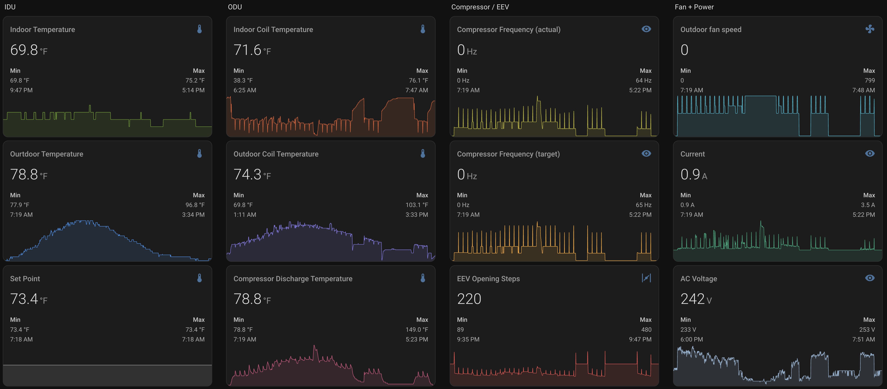
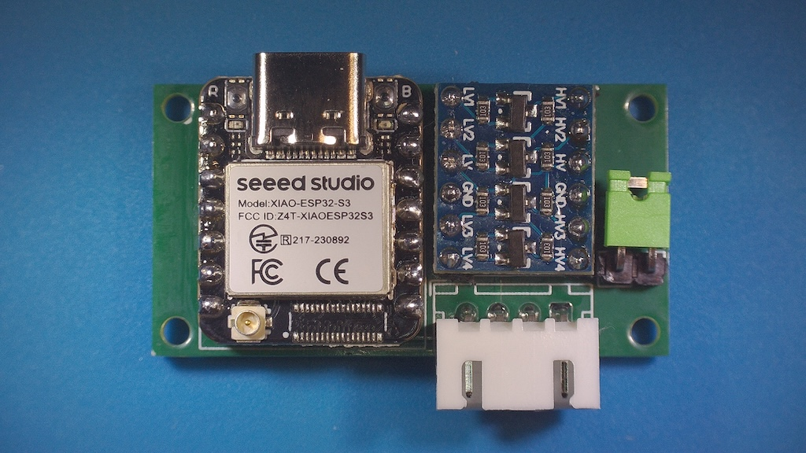
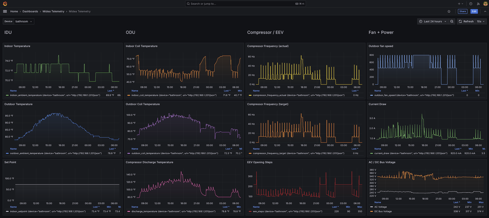

# midea-telemetry-esphome

An [ESPHome](https://esphome.io/) component to feed diagnostic-port telemetry from Midea mini-splits into Home Assistant. It supports a variety of brands including MRCOOL, Cooper&Hunter, and Pioneer.



See [Fields](#fields) for the full list of supported sensors.

## Prior Art

I've documented the diagnostic bus protocol in great detail on Medium: [Reverse Engineering Midea's ODU Diagnostic Port](https://medium.com/@florian.mckee/reverse-engineering-mideas-odu-diagnostic-port-af603e159053). The firmware in this repository is based on those findings. Start there if you want to understand the protocol; the byte mappings and conversion formulas in the [Fields](#fields) table come straight from it.

## Hardware

All you need is a **dual-core ESP32** and a level shifter. A dual core is required because the bus bit-banging runs in a dedicated FreeRTOS task. A full request/response cycle keeps the bus busy for ~380 ms, far too long to run on the main loop.


Recommended hardware:
- [XIAO ESP32S3](https://www.amazon.com/dp/B0BYSB66S5)
- [3.3V–5V Level Shifter](https://www.amazon.com/dp/B07F7W91LC)

I used the following connector kits, but you can get away with a single 4-pin male JST-XH connector:
- [XH 2.54mm Connector Kit](https://www.amazon.com/dp/B08G18PWQ6)
- [2.54mm Connector 4 Pin Male Adapter Right Angle](https://www.amazon.com/dp/B0BMDQLR4Q)

### PCB & Enclosure

The KiCad project, schematic and orderable gerbers live in [pcb/](pcb/). 2-layer, 41.5 × 22 mm, 1.6 mm, four M2 mounting holes. You solder in the ODU connector, the level shifter module and the XIAO, and that's the whole build. The FreeCAD sources for the 3D-printable enclosure are located in [enclosure/](enclosure/).

| PCB (top)  | PCB (bottom)  |
| --- | --- |
|  |  |

| Assembled dongle | Enclosure |
| --- | --- |
|  |  |


I've added a jumper that ties the diagnostic port's +5V to the XIAO's 5V pin. Use the jumper to run the board straight off the ODU with no USB cable. Leave it off if the board is connected to USB. I also recommend the use of a USB isolator since ground on the diagnostic port is not referenced to earth.


## Safety

The outdoor unit runs on mains voltage, and internal capacitors can retain a dangerous charge after being unplugged. Always

- turn off the breaker,
- pull the disconnect, and
- wait several minutes and/or verify capacitors are discharged

before performing the installation. Wear appropriate PPE. Consult a qualified electrician when in doubt.

## Installation

*(See [Safety](#safety) first if you're jumping straight to this section.)*

Remove the top panel of the ODU. You'll see the control board. Remove the screws securing the control board to the ODU, then detach the cables from the cable clamps so you can lift the board for access — there's no need to unplug the cables themselves. The diagnostic port is located at the front of the board. Plug in the dongle, with the red wire facing toward you. Reattach the cables to the cable clamps and secure the board back to the ODU. There should be enough clearance to tuck the dongle into the service panel — this lets you access the dongle later without needing to remove the control board again. Reinstall the top panel.

| Control board | Diagnostic port |
| --- | --- |
|  |  |


| Dongle plugged in | Dongle tucked into service panel |
| --- | --- |
|  |  |

For a visual walkthrough, see [this installation video](https://www.youtube.com/watch?v=poEmSZnrnjs).

## First use

Upon first start, the dongle brings up a WiFi hotspot so you can configure your WiFi settings. Join the `midea-telemetry-esphome` network (password `midea-telemetry-esphome`) and pick your home network and password in the popup that appears. Once connected, the dongle serves a webserver at `http://midea-telemetry.local` (useful if you don't run Home Assistant), and Home Assistant automatically detects it as a new ESPHome device.

| WiFi hotspot | WiFi setup |
| --- | --- |
|  |  |

| On-board webserver | Home Assistant auto-discovery |
| --- | --- |
|  |  |

## Configuration

See [example_midea_telemetry.yaml](example_midea_telemetry.yaml) for a complete configuration with every supported sensor. That file uses a local `components:` source, so it's flashable straight from a checkout of this repo; to pull the component remotely instead, switch the source to `github://fmck3516/midea-telemetry-esphome` as shown below.

The short version:

```yaml
external_components:
  - source: github://fmck3516/midea-telemetry-esphome
    components: [midea_telemetry]

midea_telemetry:
  clk_pin: GPIO3   # D2 on the XIAO ESP32S3
  dat_pin: GPIO2   # D1
  update_interval: 10s

sensor:
  - platform: midea_telemetry
    outdoor_coil_temperature:
      name: Outdoor coil temperature
    compressor_frequency_actual:
      name: Compressor frequency (actual)
    # ... every field from the Fields table below is available
```

## Flashing

Flash your ESP32 with `esphome`. On macOS:

```sh
brew install esphome
esphome run example_midea_telemetry.yaml
```

### JSON endpoint

Add `expose_json_endpoint: true` to serve all mapped sensors and the underlying raw data as JSON. It needs the `web_server` component:

```yaml
web_server:
  port: 80

midea_telemetry:
  clk_pin: GPIO3
  dat_pin: GPIO2
  expose_json_endpoint: true
```

The endpoint is served at `/json` (e.g. `http://midea-telemetry.local/json`), independent of Home Assistant. It has three sections:
- `sensors`: decoded values, null when stale or never received
- `source_bytes`: the raw byte(s) each value derives from (keyed `0x<response type>[<byte index>]`)
- `odu_responses`: the latest full frame per response type, as hex

Example:

```json
{
  "sensors": {
    "indoor_ambient_temperature": 24.5,
    "outdoor_fan_speed": 300,
    "dc_bus_voltage": 372,
    ...
  },
  "source_bytes": {
    "indoor_ambient_temperature": { "0x00[2]": 112 },
    "outdoor_fan_speed": { "0x00[7]": 44, "0x00[8]": 1 },
    "dc_bus_voltage": { "0x03[6]": 202 },
    ...
  },
  "odu_responses": {
    "0x00": "0x550070529794621F033A",
    "0x01": "0x55013797B3F1006202D4",
    ...
  }
}
```

This is useful for reverse engineering, scripting, and for using the device without Home Assistant.

### Long-term history (InfluxDB + Grafana)

For a permanent, Home-Assistant-independent history, [`influxdb-grafana/`](influxdb-grafana/) provides a ready-to-run Docker stack: Telegraf polls each dongle's `/json` endpoint, stores the decoded values in InfluxDB v2, and Grafana serves a provisioned dashboard on top. Copy `.env.example` to `.env`, list your dongles in `telegraf.conf`, and `docker compose up -d`. See [influxdb-grafana/README.md](influxdb-grafana/README.md).



## Fields

Byte mapping and conversion formulas as documented in [Reverse Engineering Midea's ODU Diagnostic Port](https://medium.com/@florian.mckee/reverse-engineering-mideas-odu-diagnostic-port-af603e159053):

| Sensor | Unit | Response | Bytes | Mapping |
|---|---|---|---|---|
| `indoor_ambient_temperature` | °C | 0 | 2 | NTC β-model ¹ |
| `indoor_coil_temperature` | °C | 0 | 3 | NTC β-model ¹ |
| `outdoor_ambient_temperature` | °C | 0 | 5 | NTC β-model ¹ |
| `outdoor_coil_temperature` | °C | 0 | 4 | NTC β-model ¹ |
| `discharge_temperature` | °C | 0 | 6 | Steinhart–Hart ² |
| `ipm_temperature` | °C | 1 | 4 | NTC β-model ¹ |
| `operating_mode` | raw | 2 | 8 | `b` |
| `compressor_frequency_target` | Hz | 2 | 2 | `b` |
| `compressor_frequency_actual` | Hz | 2 | 3 | `b` |
| `outdoor_fan_speed` | raw | 0 | 7+8 | `b₇ \| b₈ << 8` (uint16 LE) |
| `eev_steps` | raw | 1 | 5+6 | `b₅ \| b₆ << 8` (uint16 LE) |
| `indoor_setpoint` | °C | 1 | 7 | `b < 50 ? b : (b − 50) / 2` ³ |
| `input_voltage` | V | 1 | 3 | `⌊b · 32/25 + 40⌋` |
| `current_draw` | A | 1 | 2 | `0.117 · b + 0.92` |
| `dc_bus_voltage` | V | 3 | 6 | `round(b · 59/32 − 1)` |

Where `b` is the raw byte value.

¹ NTC β-model, rounded to the nearest 0.5 °C:
```
T = 1 / (1/298.15 + ln(0.81 · (255 − b) / b) / 4150) − 273.15
```

² Steinhart–Hart, with
```
L = ln((255 − b) / b)
T = 1 / (2.873×10⁻³ + 2.491×10⁻⁴ · L + 9.74×10⁻⁷ · L³) − 273.15
```

³ Two OEM encodings, told apart by range (a real set-point is ~16–32 °C): whole-degree (16–32) or half-degree +50 (82–114).

`operating_mode` is a raw integer code (e.g. `0` = cooling, `3` = fan). Map it to text in Home Assistant with a template sensor.

## Compatibility

The dongle has been tested successfully with the following outdoor units:

| Brand | Outdoor Models |
|---|---|
| MRCOOL | DIY-12-HP-C-115C25 |
| Cooper&Hunter | CH-HPR06F9-230VO, CH-N36LCU-230VO |

Since Midea-made mini-splits are very similar across brands, many other units from brands like MRCOOL, Cooper&Hunter, Senville, Pioneer, Blueridge, etc. are most likely supported as well. Check your unit's wiring diagram, or look for a diagnostic port (white 4-pin JST connector labeled `TEST`) on the control board itself, to confirm.

The wiring diagrams for the following outdoor units include the diagnostic port:

| Brand | Outdoor Models | Wiring Diagram |
|---|---| ---|
| MRCOOL | DIY-18-HP-C-230C, DIY-24-HP-C-230C, DIY-36-HP-C-230C  | [mc-diy-4-ah-sz-sm-en-01.pdf](https://doxrepo.mrcool.com/mc-diy-4-ah-sz-sm-en-01.pdf) |
| Pioneer | YN009GMFI22RPE, YN012GMFI22RPE, YN009GMFI20RPD, YN012GMFI20RPD, YN018GMFI20RPD, YN009AMFI22RPE, YN012AMFI22RPE, YN009AMFI20RPD, YN012AMFI20RPD, YN018GMFI22RPE, YN024GMFI22RPE, YN024GMFI20RPD, YN030GMFI20RPD, YN036GMFI20RPD  | [WYS_SM.pdf](https://www.pdhvac.com/site/downloads/WYS_SM.pdf) |

The following outdoor unit models reportedly lack a diagnostic port, or their wiring diagrams show no such port:

| Brand | Outdoor Model | Wiring Diagram |
|---|---|---|
| Pioneer | YN036GLFI19RPE | n/a |
| Carrier | 38MARBQ24AA3 | [SG-38MARB-02.pdf](https://www.shareddocs.com/hvac/docs/1009/Public/03/SG-38MARB-02.pdf) |

I haven't had a chance to analyze the diagnostic bus on a multi-head unit yet. Supporting these units will likely require firmware enhancements beyond what's currently implemented.

## Warranty

This is a hobby project. I've permanently installed the telemetry module on all of my units without any problems. That said, use it at your own risk. I do not assume any liability if it causes damage to your equipment. See [LICENSE](LICENSE) for additional information.

## Disclaimer

Midea is a trademark of Midea Group. This is an independent, unofficial hobby project and is not affiliated with, authorized, endorsed by, or sponsored by Midea. The name is used only to describe which hardware the project interoperates with. All product names and trademarks are the property of their respective owners.
